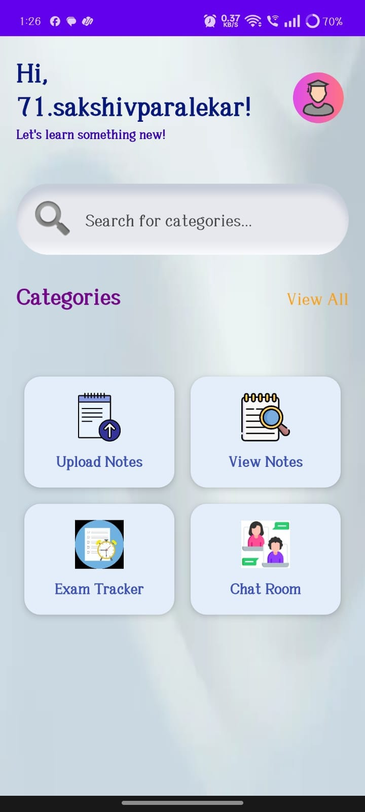
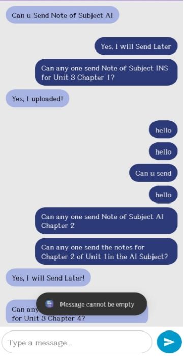
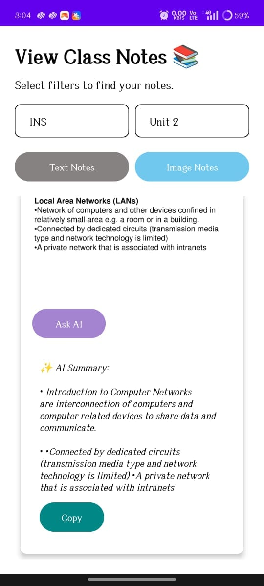
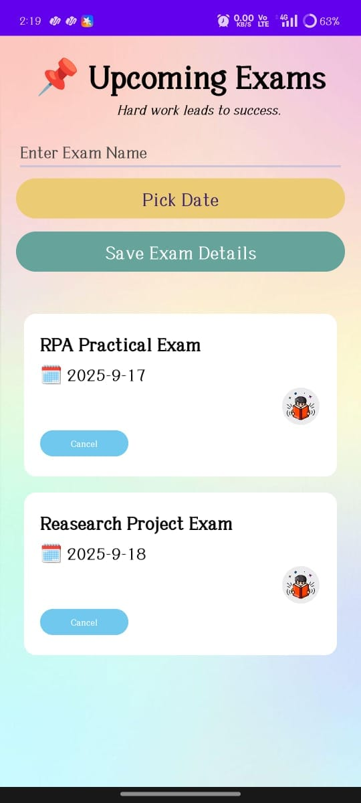
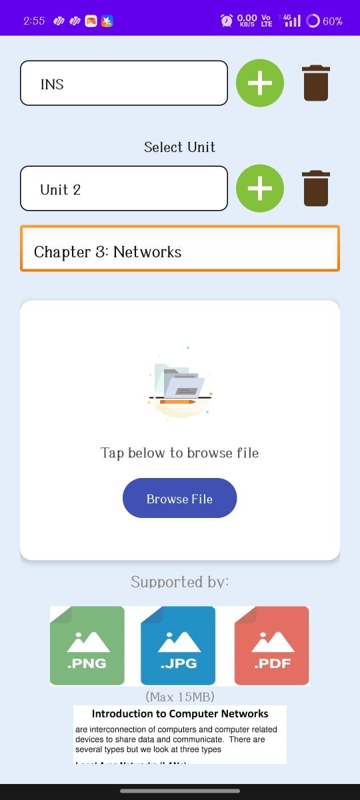
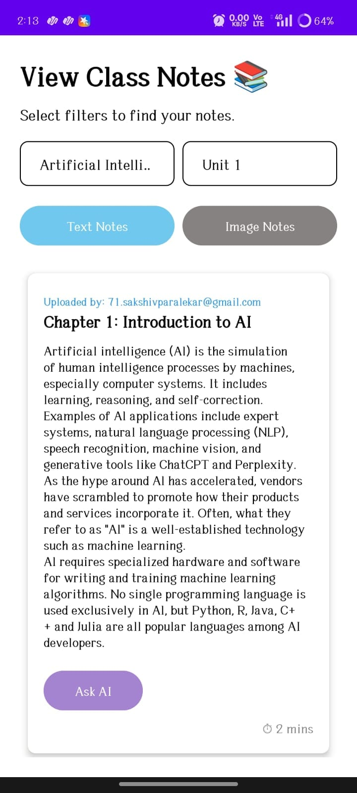

# ClassLink – Android Application

ClassLink is an Android application developed to help students manage their classes and study materials in one place.

## Technologies Used

- Java
- XML
- Android Studio
- Firebase
- Git & GitHub

## Features

- User authentication
- Class and group management
- Chat room for class communication
- Notes and study material management
- File upload and storage
- AI-powered study material summarization
- Exam tracker for managing upcoming exams
- Student-friendly Android interface

## 📱 Project

This project was developed as an academic Android application using Android Studio.

## 👩‍💻 Developer

**Sakshi Paralekar**

GitHub: [SakshiParalekar](https://github.com/SakshiParalekar)

## 📸 App Screenshots

## 📸 App Screenshots

### Home

### Chat Room

### AI Summary

### Exam Tracker

### Study Material

### Notes

